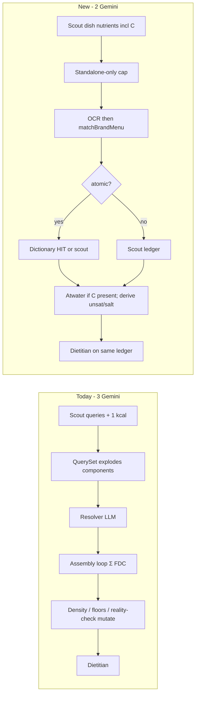
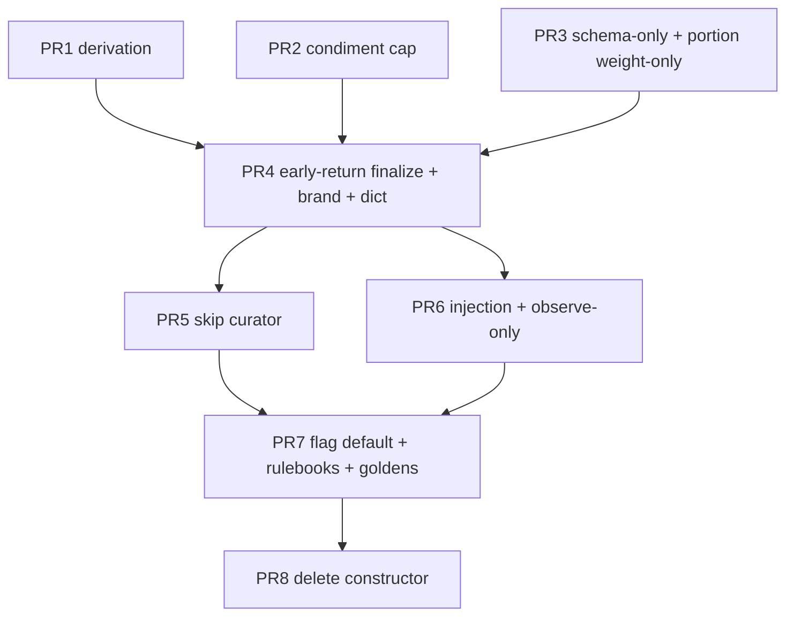

# Food pipeline inversion: dish-level estimate default, USDA as dictionary

| Field | Value |
|-------|--------|
| **Author** | Architecture (scratch; lands in `plan/FOOD.md` after approval) |
| **Date** | 2026-08-23 (rev 3, 2026-08-24) |
| **Status** | Draft |
| **IMPACT class** | **L** (food pipeline) |
| **Domain** | Food-calc |
| **Related (read, not rewritten here)** | `plan/FOOD.md`, `docs/agent/domains/food-calc.md`, `plan/QUALITY.md`, `plan/ROADMAP.md` |
| **Prototype evidence** | `prototype/` (gemini-3.5-flash-lite, scout → derivation → dietitian) vs `existing-log/` |
| **Durable home after approval** | Revise **`plan/FOOD.md`** (truth hierarchy + pipeline). Same change as flag-on default: `docs/agent/domains/food-calc.md` (protected — AGENTS.md §3 confirmation required). **Do not add a sixth `plan/*.md`.** |

This scratch document is the complete end-to-end design. Implementation does **not** mint a new plan file. After human confirmation on the protected rulebook, the architecture is copied into `plan/FOOD.md` Part A (replacing the current “atomic foundation as constructor” target flow) and the food-calc pipeline table is updated **in the same PR as flag-on default**. Constructor-path deletion is a later PR; env `FOOD_DISH_ESTIMATE=0` remains a rollback until then.

---

## Overview

Production food-calc still treats Vision Scout as a **recipe author** (clinical `searchQuery` per component, mass%/volume%, one soft `estimatedCalories`) and the backend as a **constructor** (Σ USDA/OFF/catalog rows × weight, then a stack of density / Atwater / sodium-floor / reality-check gates that mutate the dish until the numbers look legal). The 6-meal tape shows the constructor + gate stack is the fragility: scout identity is often already good, then volumetric 30 g caps, brand-lock strips, false-friend FDC rows, and silent rescales destroy the meal. Golden success is still “this meal’s FDC IDs match a spreadsheet,” which rewards catalog paint (`AGENTS.md` L14).

The inversion: **hot path is 2 Gemini calls** (Vision Scout + Dietitian). Scout emits **per-dish core nutrients including carbohydrates** plus identity (name, brand, boxes, weight, ingredient **names**, printed OCR). TypeScript derives unsaturated fat and salt; Atwater residual is computed **from scout-emitted C/P/F vs kcal before any derivation**. USDA is a **dictionary lookup of atomic staples**, not a recipe engine. Composed dishes never assemble from component FDC rows. Food Resolver is **off the hot path**. Dietitian coaches on the **single chosen ledger** — no second set of macros. Feature-flagged (`FOOD_DISH_ESTIMATE`, default off) until the 6 prototype photos pass on the new path; rollback is flag off.

This is product evolution of the pipeline, not “fix more gates.” A 4th LLM estimator on MISS is rejected. Keeping `searchQuery` **and** nutrients is rejected (L12 / prompt already full). Scout prompt change is a **behavior inventory** (keep identity/OCR/split laws; delete USDA inversion / mass% / `queriesToSearch` / `suggestedFdcId` / estimatedCalories-only), **not** “delete the STEP 3 heading.” Net-zero line count is measured on the whole `scoutSystemInstruction` string including the JSON schema example.

---

## Background & Motivation

### Why this change

`plan/FOOD.md` §4 still encodes a 5-rung hierarchy whose middle rung is **foundation = Σ resolved atomics**. `docs/agent/domains/food-calc.md` §1 still says scout may emit only **one** soft `estimatedCalories` per dish, not full macros. Both were honest for the curator era. They are now the source of bug-per-meal:

1. **Constructor fan-out.** `buildFoodSearchQuerySet` always pushes every `components[].searchQuery` (and parent `originalName` / `keyword` / `queriesToSearch`). Yolk log: 11 USDA/OFF queries for one plate (`french bread`, `grilled chicken breast`, `chimichurri sauce`, `cheese`, …). Log: `[Database Search] Performing USDA & OFF searches for queries:`.
2. **Parent-dish volumetric cap.** After scout, `isCondiment` substring-tests `mayonnaise|ranch|dressing|sauce|ketchup|mustard|dip` on **`originalName` OR `keyword`** and rewrites `estimatedWeightGrams` to 30 if > 50 g. Log: `[Volumetric Tuning] Capped high-density condiment`. **Yolk:** keyword `"chicken sandwich with chimichurri sauce"` contains `sauce`; originalName `"YOLK Steak Chimi 2.0 Sandwich"` would not. **Sushi:** originalName `"Shrimp and pasta salad with thousand island dressing"` contains `dressing`; keyword `"shrimp pasta salad"` does not. **`salad` is not a cap trigger.** The class is condiment substring in the parent-dish **haystack**, not a salad token.
3. **Gates that punish the cap.** After weight is 30 g, brand 760 kcal looks like 2533 kcal/100 g. `checkThermodynamicDensitySanity` logs `[Thermodynamic Density Gate] BREACH` and `server.ts` **strips the brand calorie lock** (`truthMatch = null`), then falls back to USDA component assembly. Siblings that also null `truthMatch`: `checkArchetypeMacroBounds` (`[Macro Archetype Violation]`) and the OCR-broadcast detector (`[OCR Broadcast Detector]`). Then `applyNutrientRealityChecks` (receipt pass) rescales 408 → 95 kcal because 1360 kcal/100 g on a 30 g “sandwich” is “implausible.” Log: `[Dietitian Reality Check] Caloric density … Rescaled`.
4. **False friends as construction material.** Cheese → Yolk “Salmon & Cream Cheese Bap”; jam → strawberry commodity because `lookupCanonicalBaseFood` matches `includes('strawberry')` **before** the `fruit_jam` branch; sushi Vit D 199.7 mcg from a wrong FDC plus `backfillSparseMicronutrients`. Resolver is a catalog curator **on paper**; production still emits 31 nutrients so MISS becomes category fallback + floors, i.e. a silent constructor.
5. **Two books.** Mie Gacoan: scout 420 kcal noodles vs foundation 708 (`[Reconcile] … action=keep foundation=707.52 budget=420`); table `addedSugar` ~15 vs dietitian narrative 37.3. Picnic fruit cup 497 kcal / high added sugar from component sum. Trial-balance reds are classified `SILENT_REPAIR` (`QUALITY.md`) but the pipeline keeps “repairing” them.

Current Gemini budget on tape: **scout + food_resolver + dietitian = 3**. Target: **2**.

### Evidence from the 6-meal tape

Prototype (`prototype/`, model `gemini-3.5-flash-lite`, scout → `derivation_engine.ts` → dietitian — **no USDA**) vs production (`existing-log/`). Production failure classes verified in the debug logs; prototype numbers from the agreed tape (latest `prototype/REPORT_*.md` may differ slightly on a re-run — the **class** is the evidence).

| Meal | Production failure class (verified) | Prototype |
|---|---|---|
| **Yolk wrap** | Scout ~350 g / ~650 kcal named `YOLK Steak Chimi 2.0`; `[Volumetric Tuning]` on keyword containing `sauce` → 30 g; brand 760 stripped (`[Thermodynamic Density Gate] BREACH` 2533 kcal/100 g); cheese → cream cheese bap; `[Dietitian Reality Check]` `408 → 95 kcal`. Table ~362 kcal meal, narrative 32.3 g protein on a 30 g sandwich. | 320 g sandwich kept; meal ~970 kcal class. Residual: generic name / brand matcher miss on some runs; cabbage side miss. Identity+weight preserved. |
| **Lidl pack** | OCR 154 / 16.2 P / 8.5 F locked (`source=label hard=true`). Tie. | Tie. Printed-label path already works when gates do not strip it. |
| **Sushi lunch** | Salad scout ~300 g → cap 30 g / 28 kcal because **originalName** contains `dressing` (`[Volumetric Tuning] Capped … "shrimp pasta salad"` prints keyword; trigger is originalName). Vit D false friend + sparse micro backfill. Baguette 180 g USDA assembly. | Salad 320 g / ~420–480 kept. Baguette lighter visual ~120–150 g. Prototype has **no USDA**; a production atomic MULTI for “baguette” **stays scout** (see §6 HIT). |
| **Picnic** | Prod correctly split croissant + cinnamon swirl because of **PRECISE COUNTING, BAG INSPECTION** (today under the STEP 3 heading, not STEP 2). Fruit cup 497 / added sugar inflated by component sum. | Merged pastries on some runs. **Counting/split is a kept scout behavior** — do not drop it when deleting USDA-query bullets. |
| **Airline** | Jam scout 50 kcal / 20 g → strawberry commodity (`lookupCanonicalBaseFood` strawberry-before-jam). | Jam ~56 kcal / 20 g, jam-like density. |
| **Mie Gacoan** | Noodles foundation 708 vs scout 420; table `addedSugar` ~15 vs dietitian 37.3. | Drink 280 / 45 g added sugar; internally consistent books. |

**Conclusion to encode:** production scout **identity** was often already good. The **constructor + gate stack** is the fragility. Prototype is the **replacement default**, not an extra stage, not a 4th LLM.

### Current production pipeline (verified, not invented)

```text
Vision Scout (LLM #1)  scoutSystemInstruction + inline analyze prompt (server.ts)
  identity / OCR / bag inspection / brand-separation
  + USDA searchQuery / mass% / estimatedCalories-only
        │
        ▼
isCondiment haystack cap → 30 g            [Volumetric Tuning]
        │
        ▼
buildFoodSearchQuerySet                    [QuerySet] / [Database Search]
  (components + parent name + keyword)
        │
        ▼
searchUSDA / OFF / searchBrandMenuItems    [Brand DB Match] inside query loop
        │
        ├── rankAndClassifyCandidates HIT_UNIQUE
        └── executeFoodResolverCurator     [CuratorCase]  (LLM #2)
        │
        ▼
preCalculatedItems = visionScoutItems.map  (assembly loop)
  component forEach, verifiedFdcHintMap, decidePrepAddition,
  density/archetype/OCR strip, computeItemBudget, reconcileNutrients,
  FOUNDATION_BUDGET_DIVERGENCE, applyNutrientRealityChecks
        │
        ▼
portion pause? buildPortionClarifyPayload → skipScout turn 2
  applyPortionChoices scales estimatedCalories only
        │
        ▼
Dietitian (LLM #3)  projectDietitianInput
  First-Principles Injection if hasComponents || bestMatchDbId
  receipt applyNutrientRealityChecks again
```

Hot files: `server_vision_scout.ts` (`scoutSystemInstruction`, `isCondiment`, `mergeScoutItems`), `agents/scoutInstructions.ts` (`buildVisualScoutPrompt`) **and** the duplicate inline prompt in analyze, `server_query_set.ts` (`buildFoodSearchQuerySet`), `serverBrandMenu.ts` (`searchBrandMenuItems`, `brandHitFitsQuery`), `server_food_resolver_curator.ts` (`executeFoodResolverCurator`), `server.ts` (analyze assembly map starting `preCalculatedItems = visionScoutItems.map`, Mode D `portionAndReconcile`, live Edit weight-scale, mock Edit when API key missing), `server_budget_reconcile.ts` (`computeItemBudget`, `parseLabelCalories`, `portionAndReconcile`), `server_pure_helpers.ts` (`checkThermodynamicDensitySanity`, `checkArchetypeMacroBounds`, `applyNutrientRealityChecks`, `checkAtwaterConsistency`, `backfillSparseMicronutrients`), `server_fdc_resolve.ts` (`rankAndClassifyCandidates`, `writeAliasIfHitUnique`), `server_food_db.ts` (`lookupCanonicalBaseFood`), `server_prep_policy.ts` (`decidePrepAddition`), `server_portion_clarify.ts` (`applyPortionChoices`), `server_nutrient_aggregation.ts`, `src/mealBuild/projectors.ts` (`projectDietitianInput`), `NutritionLabelTable.tsx` (`getSourceBadge`).

---

## Goals & Non-Goals

### Goals

1. Hot path **2 Gemini calls**: Vision Scout + Dietitian. Resolver **0** on hot path.
2. Scout emits **dish-level core nutrients including carbohydrates** + identity. Drop `components[].searchQuery`, mass%/volume%, `queriesToSearch`, `suggestedFdcId`, estimatedCalories-only. Keep `originalName`, `chainName`, optional `keyword`, boxes, weight, `cookingMethod`, ingredient **names**, printed `rawNutritionLabel`.
3. USDA is a **dictionary**: lookup the *dish* when it is an atomic staple. HIT (defined in §6) → `per_100g × consumedWeight` for unlocked macros + micros. MULTI / MISS → stop; leave scout numbers. **Never** Σ component FDC rows to construct a restaurant dish.
4. **3-rung truth hierarchy:** (1) printed OCR keys (2) official brand menu macros via standalone `matchBrandMenu` (3) scout dish nutrients. USDA overlay **only on atomics**. Scout `estimatedCalories`-only is gone.
5. **Weight is sacred.** Cap only when condiment token is in the name haystack **and** no parent-dish token is present. Density / archetype / reality-check **must not rescale dish kcal** and **must not strip brand kcal locks**.
6. Scout emits carbohydrates. TypeScript derives unsaturated fat and salt. Atwater residual is **real** (scout C vs kcal) and **flags**; it does not silently rescale.
7. Dietitian coaches on the **chosen ledger only**. Injection predicate = finalize ledger present. Extended micros: dietitian meal-level directional fill of **empty** keys, labelled `estimated`; remaining nulls render `--`.
8. Success metric: dish identity + weight preserved; locks honored; composed dishes do not go through component USDA assembly; **saved table kcal === dietitian payload kcal**.
9. One shared `finalizeDishLedger` for Mode A / D / Edit in the same PR that wires it (food-calc L2/L5). If a mode cannot land in that PR, it is `known-broken` in `AI_HANDOVER.md`.
10. Feature flag with rollback; rulebooks updated **in the same change as flag-on default**. Constructor deletion later. No sixth plan file.

### Non-goals

- A 4th LLM “estimator” on MISS (explicitly rejected).
- Keeping atomic-foundation-as-constructor and “just fix more gates.”
- Scout emitting `searchQuery` **and** nutrients (rejected: L12).
- Rebuilding the curator (`plan/FOOD.md` F-1…F-4 / M30). Curator stays as **offline catalog librarian**.
- Painting G1–G7 `expectFdcId` / `all_green` FDC lists (`AGENTS.md` L14).
- Changing biomarker, sync, or meal-document OCC (`plan/FOOD.md` Part B) except `itemsBreakdown` source badges and component display.
- Inventing a parallel `basic_foods` schema.
- Treating `lookupCanonicalBaseFood` substring `includes()` as dictionary HIT.
- Prompt bloat: L12 net-zero on the **whole** `scoutSystemInstruction` including JSON schema.

---

## Key Decisions

Settled product decisions (not open). Q1–Q2 / jam overlay / composed micros are **closed here**, not reopened below.

| # | Decision | Rationale |
|---|----------|-----------|
| K1 | **Hot path = Scout + Dietitian only.** Resolver off hot path. | Tape is 3 Gemini calls. Curator cannot save a 30 g sandwich. `executeFoodResolverCurator` is the 3rd call. Offline alias writes remain valuable; they are not meal math. |
| K2 | **Behavior swap, don’t stack.** Delete USDA inversion / mass% / `queriesToSearch` / `suggestedFdcId` / estimatedCalories-only / required `components`. Keep bag inspection, 100 g OCR, brand-separation, user-message scope. Rewrite STEP 2 so it does not require components. Net-zero on the **whole** `scoutSystemInstruction` including JSON schema. | Picnic split lives under today’s STEP 3 heading (`PRECISE COUNTING, BAG INSPECTION`). Literal “replace STEP 3 lines” would drop it. STEP 2 still says ALWAYS decompose `components` — leaving that stacks search terms. |
| K3 | **USDA = dictionary of atomics, not recipe engine.** HIT overlay; MULTI/MISS stop. | Constructor is the Yolk/sushi/jam failure class. |
| K4 | **3-rung truth:** OCR → brand menu (`matchBrandMenu`) → scout. USDA overlay only on atomics. | Replaces `plan/FOOD.md` §4 rungs 3–5. Category×W is not a rung. `dish_cache` only on **exact dish HIT**, else drop. |
| K5 | **Weight is sacred.** Cap iff condiment token in `originalName+keyword` **and** no parent-dish token. `salad` is **not** a cap trigger. | Yolk = keyword `sauce`. Sushi = originalName `dressing`. Dual-check both name fields in every test. |
| K6 | **Brand lock identity vs value.** Analyze: unique `matchBrandMenu` HIT locks keys at scout weight (`per_dish` 760 stays 760 for that portion). Portion/D8: **do not re-fetch** a per_dish row to overwrite; scale already-locked keys by `R`. Per_100g OCR/brand re-rate at `consumedWeight/100`. HIT rule: exact `normalizeDishKey` **or** top ≥ 0.92 and top ≥ 2× second; else MULTI no lock. No 0.5–2.5× Smart Unit clamp. | `searchBrandMenuItems` returns up to 5 rows at chain threshold 0.45 and hardcodes DTO `basisType: 'per_dish'`. Use catalog `matchedItem.basis_type` / `serving_grams`. Re-locking 760 onto a half sandwich fights D8. |
| K7 | **Scout emits carbohydrates.** If C present: Atwater flag at `ATWATER_TOLERANCE` 0.35, no rescale. If C missing: **skip flag**, derive C. TS always derives unsaturated fat and salt. Alcohol skip kept. | Missing C would flag every dish if treated as 0. Derived C must not be the residual. |
| K8 | **Dietitian: one ledger.** Injection when finalize ledger present (always on flag-on). Discard `foodData` kcal/protein vs ledger. Entire mutate stack observe-only. | Today `[First-Principles Injection]` requires `hasComponents \|\| bestMatchDbId` — composed estimated dishes abort. Receipt `applyNutrientRealityChecks` is the 408→95 site. |
| K9 | **No 4th LLM.** Prototype **is** the new default. | Human rejected estimator-on-MISS. |
| K10 | **Golden metric = identity + weight + locks + trial balance**, not FDC lists. | `plan/QUALITY.md` class-first. Frozen scout JSON in CI — no live Gemini. |
| K11 | **Flag `FOOD_DISH_ESTIMATE`, default off.** Same finalize helper A/D/Edit. After flag-on default (same PR as rulebooks), delete constructor in a **later** PR. Time-box env `0` to **one release (~14 days) after default-on**. | Rollback = env off until delete. Do not leave a silent side pipeline after delete. |
| K12 | **Classifier (closed):** Shared `PARENT_DISH_RE` (includes `sushi\|maki\|nigiri\|pizza\|curry\|omelette\|roll`). Parent token → composed **unless** residual is a single staple phrase (`dinner roll`). Else allowlist only if residual **equals** one staple phrase (not `.test()` contains). Composed idioms: `grilled cheese`, `butter chicken`. | Substring allowlist made `"sushi roll"` / `"butter chicken"` atomic. Cap and classifier must share one `PARENT_DISH_RE`. |
| K13 | **Composed micros (closed):** dietitian **meal-level** directional fill of empty **extended** keys only, labelled `estimated`. Per-item extended keys stay null and render `--` (do not write 0). Core 15+derived always numeric on the parent. | Prototype fills meal-level extended. Writing 0 via `cleanNutrientVal` is a lie. |
| K14 | **Protected docs update in the same PR as flag-on default (PR 7), including `DOMAIN_REGRESSION_MAP.md`.** PR 4 ships tests but does **not** silently edit `docs/agent/**`. Constructor deletion is PR 8. | Growing the smoke list is right; `docs/agent/**` is §3-protected. CI can run files not yet listed. |

---

## Proposed Design

### 1. Target sequence (including portion pause)

```mermaid
sequenceDiagram
  participant U as User photo+text
  participant S as Vision Scout (LLM 1)
  participant Cap as standaloneCondimentCap
  participant P as portionClarify pause
  participant F as finalizeDishLedger (TS)
  participant B as matchBrandMenu
  participant D as USDA dictionary (atomics)
  participant T as Dietitian (LLM 2)
  participant UI as saved table

  U->>S: image(s) + user message
  Note over S: Keep: scene, split, brand, boxes, OCR, bag inspection
  Note over S: Delete: searchQuery, mass%, queriesToSearch, estimatedCalories-only
  S->>Cap: items[] (nutrients + identity)
  Note over Cap: Cap/portion ONLY write estimatedWeightGrams
  Cap-->>Cap: haystack cap iff condiment AND NOT parent-dish token
  alt needsPortionClarify
    Cap->>P: pause carries identity, unscaled nutrients, nutrientBasisWeight
    P-->>F: skipScout; applyPortionChoices writes weight only
  else no pause
    Cap->>F: items
  end
  F->>F: ONE scaler: nutrients × consumedWeight / nutrientBasisWeight
  F->>F: OCR: per_100g re-rate; per_dish scale locked keys by R (no re-fetch)
  alt first analyze and no stored brand lock
    F->>B: matchBrandMenu(chainName, originalName)
    alt HIT exact key or score≥0.92 and ≥2× second
      B-->>F: lock keys at scout weight (per_dish 760 stays 760)
    else MULTI / MISS
      B-->>F: no lock
    end
  else portion / D8
    Note over F: do not re-fetch per_dish; scale stored locked keys by R
  end
  F->>F: classifyDishAtomic (shared PARENT_DISH_RE)
  alt atomic
    F->>D: finalize owns alias → food_items food_key maybeSingle → FDC HIT_UNIQUE
    D-->>F: HIT overlay; MULTI/MISS keep scout
  else composed
    Note over F: skip global search loop; usdaQueries empty
  end
  F->>F: Atwater flag only if C present; else derive C
  F->>T: itemsBreakdown === table ledger
  T-->>UI: coach; empty extended keys labelled estimate; null → --
```

### 2. Current vs new



### 3. Scout prompt — inventory by behavior (not heading number)

Picnic split, UK/EU 100 g column, brand-separation, and “I only ate X” **must survive**. They currently live under mixed STEP 2 / STEP 3 headings. Implementation edits `scoutSystemInstruction` as **one string**. CI: `scoutSystemInstruction.split('\n').length` equals the pre-change baseline (net-zero). Same budget for the JSON schema example.

#### Keep (rewrite into the kept block; do not require `components`)

| Behavior | Today’s heading | Keep as |
|----------|-----------------|---------|
| Scene `contentType` / `diningEnvironment` | STEP 1 | STEP 1 |
| Multi-dish extraction; user-message scope; “I only ate X”; beverage fill height | STEP 2 | STEP 2 |
| Cross-image dedup | STEP 2 | STEP 2 |
| Brand + **exact dish title** in `originalName`; `chainName` alone | STEP 2 | STEP 2 (drop `queriesToSearch` bullet) |
| Printed OCR only; `lockedNutrientKeys`; sugar vs addedSugar | STEP 2 | STEP 2 + compact copy into `nutrients` |
| Brand-separation (Sainsbury oats vs companion fruit) | STEP 3 | STEP 2 |
| PRECISE COUNTING, BAG INSPECTION & OCCLUSION (croissant on cinnamon swirl) | STEP 3 | STEP 2 |
| Compact mode ≥ 15 items | STEP 3 | STEP 2 |
| FORCE THE 100G BASELINE + deduce serving grams; salt→sodium | STEP 3 | STEP 2 OCR |
| Bounding boxes, `sourceImageIndex`, `itemConfidence`, `cookingMethod` | schema | schema |
| Optional `keyword` (display/debug; cap haystack) | schema | schema, optional |

#### Delete (do not leave in STEP 2, STEP 3, or the JSON example)

| Behavior | Why |
|----------|-----|
| `queriesToSearch` (STEP 2 brand bullet + root schema key) | Brand match is `matchBrandMenu`, not FDC |
| ALWAYS decompose mixed dishes into `components` & first-principles 31-key (STEP 2 last paragraph) | Stacking; human forbade searchQuery AND nutrients |
| USDA retrieval / inverted queries / `searchQuery` | Dictionary built in TS from `originalName` |
| Canonical component decomposition; `suggestedFdcId` | Constructor |
| PREPARATION FAT as a **component row** with mass% | Scout fat is in dish nutrients; skip `decidePrepAddition` |
| MASS PERCENTAGE / volumePercentage / seasoning % rules | No component constructor |
| Preserve brand **in component searchQuery** | No component queries |
| SOFT `estimatedCalories`-only (do not invent protein/fat/sodium) | Replaced by full core nutrients **including carbohydrates** |
| Schema `components[]`, root `queriesToSearch`, `estimatedCalories` as the only number | Constructor-shaped example would re-teach the model |

#### New STEP 3 (dish nutrients — swap, not stack)

List identified ingredients as **plain name strings** (`ingredients`). Estimate `estimatedWeightGrams`. Emit per-dish core nutrients for the **portion shown**, including **carbohydrates** (so Atwater is a real residual). Do **not** output search keywords, mass/volume %, or FDC IDs. If a printed panel is visible, transcribe only literal keys into `rawNutritionLabel` + `lockedNutrientKeys` and copy those keys into `nutrients`.

Scout core keys (emitted): `calories`, `protein`, `totalFat`, `saturatedFat`, `transFat`, `addedSugar`, `totalFibre`, `sodium`, `totalSugar` (mapped → `sugar`), `carbohydrates`, `potassium`, `omega3`, `calcium`, `iron`, `magnesium`, `vitaminD`.

TS-derived after Atwater: `unsaturatedFat`, `salt` (and `carbohydrates` **only if** scout omitted C).

#### Item schema (flag-on)

```ts
export const ScoutNutrientsSchema = z.object({
  calories: z.number().nullable().optional(),
  protein: z.number().nullable().optional(),
  totalFat: z.number().nullable().optional(),
  saturatedFat: z.number().nullable().optional(),
  transFat: z.number().nullable().optional(),
  addedSugar: z.number().nullable().optional(),
  totalFibre: z.number().nullable().optional(),
  sodium: z.number().nullable().optional(),
  totalSugar: z.number().nullable().optional(), // mapped → sugar
  carbohydrates: z.number().nullable().optional(), // required for Atwater residual
  potassium: z.number().nullable().optional(),
  omega3: z.number().nullable().optional(),
  calcium: z.number().nullable().optional(),
  iron: z.number().nullable().optional(),
  magnesium: z.number().nullable().optional(),
  vitaminD: z.number().nullable().optional(),
}).passthrough();

export const ScoutItemSchema = z.object({
  originalName: z.string().optional(),
  keyword: z.string().optional(), // keep: cap haystack, Mode D, matching
  chainName: z.string().nullable().optional(),
  estimatedWeightGrams: z.number().finite().nonnegative().optional(),
  cookingMethod: z.string().optional(),
  ingredients: z.array(z.string()).optional(),
  nutrients: ScoutNutrientsSchema.optional(),
  boundingBox2D: z.array(z.number()).optional(),
  sourceImageIndex: z.number().optional(),
  itemConfidence: z.string().optional(),
  rawNutritionLabel: z.record(z.any()).nullable().optional(),
  lockedNutrientKeys: z.array(z.string()).nullable().optional(),
}).passthrough();
```

**Server ignores if present:** `searchQuery`, `queriesToSearch`, `components[].volumePercentage` / `massPercentage` / `suggestedFdcId`. Unit test asserts finalize did not read them.

**Compat:** if a model still emits `estimatedCalories` only, map once to `nutrients.calories`. `mergeScoutItems` must preserve `nutrients`, `chainName`, `rawNutritionLabel`, `lockedNutrientKeys`, `ingredients` (copy to `visualIngredients`).

**Both user prompts** (L12 net-zero each, drop `queriesToSearch`):

- `buildVisualScoutPrompt` (`agents/scoutInstructions.ts`)
- Inline analyze prompt in `server.ts` (`scoutPromptText` — “capture exact brand and dish name in originalName **and queriesToSearch**”)

### 4. Nutrient key and UI mapping

| Scout / OCR | Stored `NUTRIENT_KEYS` | Notes |
|-------------|------------------------|--------|
| `totalSugar` | `sugar` | |
| OCR `sugar` | `sugar` | |
| OCR `salt` | `sodium` | existing: salt g → sodium mg (`× 1000 / 2.54`) |
| OCR `totalCarbohydrate` | `carbohydrates` | |
| `ingredients[]` | copy → `visualIngredients` | UI chips read `visualIngredients` / `ingredientsList` (`NutritionLabelTable.tsx`) |
| — | `unsaturatedFat`, `salt` | TS derive |
| missing extended key | `null` (not 0) | `formatNutrientDisplayValue` must render `--` for null/undefined **without** `cleanNutrientVal` coercing 0 |

`getSourceBadge` uses ledger `dbSource`: `label` \| `brand_official` \| `usda` \| `estimated`. Never `composite` as the **constructor** source on new meals.

**New meals:** `componentsDetailList` absent or **name-only stubs** (no FDC ids, no per-child kcal). Parent holds kcal. Do not scale phantom FDC children. **Old saved composite meals** still render via existing `componentsDetailList` (L6). Update `server_nutrient_aggregation` tests in the finalize PR so they do not assume FDC children on flag-on.

### 5. Standalone condiment cap (PR 2 — implementable)

Cap and classifier **share one** `PARENT_DISH_RE` exported from `server_dish_classify.ts` (do not fork).

```ts
export const PARENT_DISH_RE = /\b(sandwich|wrap|salad|bowl|smoothie|parfait|cake|pie|soup|burger|sub|toastie|burrito|taco|panini|noodle|pasta|fried rice|stir-?fry|sushi|maki|nigiri|pizza|curry|omelette|omelet|macaroni|risotto|stew|casserole|biryani|roll)\b/i;

const CONDIMENT_RE = /\b(mayonnaise|mayo|ranch|dressing|sauce|ketchup|mustard|dip)\b/i;

export function isStandaloneCondimentPacket(item: {
  originalName?: string; keyword?: string;
}): boolean {
  const haystack = `${item.originalName || ''} ${item.keyword || ''}`;
  if (!CONDIMENT_RE.test(haystack)) return false;
  if (PARENT_DISH_RE.test(haystack)) return false;
  return true;
}
```

Cap `estimatedWeightGrams` to 30 **iff** `isStandaloneCondimentPacket` and weight > 50. **Do not multiply nutrient keys here.** Snapshot `nutrientBasisWeight = original estimatedWeightGrams` once at scout parse if missing; cap only mutates `estimatedWeightGrams`. `finalizeDishLedger` is the only scaler (test: 80 g mayo → 30 g scales kcal **once**).

- **`salad` is not a trigger.** Parent-token `salad` is an **exclusion** so `"shrimp pasta salad with thousand island dressing"` does not cap.
- Every test dual-checks **both** `originalName` and `keyword`.
- `"chicken sandwich with chimichurri sauce"` (keyword or originalName) → **no cap**.
- `"Shrimp and pasta salad with thousand island dressing"` → **no cap**.
- `"Heinz mayonnaise"` / `"ranch dressing"` as the **only** item, no parent token, 80 g → cap 30 g (standalone condiment, not necessarily a sachet — name is Packet in comments only; the predicate is standalone condiment).
- Ramekin of mayo next to a sandwich: **separate item** with condiment name and no parent token may cap; the sandwich item must not.

After this cap-fix, Yolk 760 kcal / 350 g ≈ 217 kcal/100 g is **under** the 250 `plain_meat_poultry_fish` density ceiling. Residual brand-lock stripper is more likely **`checkArchetypeMacroBounds`** (carbs on a name containing chicken), not density. Archetype strip is disabled on the new path in PR 4, not PR 2.

### 6. Finalize algorithm (per dish)

Extract **`finalizeDishLedger`** into `server_dish_finalize.ts`. **One scaler:** cap and `applyPortionChoices` **only write `estimatedWeightGrams`**. Nutrients on the item stay at scout-emitted (or last-finalized) portion totals until this function. Never treat portion totals as per-100 g unless the lock’s catalog `basis_type` is `per_100g`.

```ts
export type FinalizeInput = {
  item: ScoutItem; // nutrients are portion totals at nutrientBasisWeight (unscaled by cap/portion)
  nutrientBasisWeight: number; // grams those nutrients correspond to (scout snapshot; D8 = stored weightGrams)
  consumedWeight: number;      // estimatedWeightGrams after cap / portion / edit
  storedBrandLock?: {          // portion/D8: identity already locked
    id: string;
    basisType: 'per_dish' | 'per_100g' | string;
    servingGrams: number | null;
    keys: string[];
    valuesAtBasis: Record<string, number>; // values at nutrientBasisWeight
    per100g?: Record<string, number> | null;
  } | null;
};

export type DishLedger = {
  scoutIndex: number;
  originalName: string;
  keyword?: string;
  chainName: string | null;
  weightGrams: number;                 // consumedWeight — sacred
  nutrientBasisWeight: number;
  ingredients: string[];
  visualIngredients: string[];
  nutrients: Record<string, number | null>;
  lockedNutrientKeys: string[];
  brandLock?: FinalizeInput['storedBrandLock'];
  dishClass: 'atomic' | 'composed';
  dbSource: 'label' | 'brand_official' | 'usda' | 'estimated';
  dbId: string | null;
  atwaterFlag: { deviationPct: number; flagged: boolean } | null;
  usdaQueries: string[];               // 0 or 1
};
```

**Calling convention**

| Path | `nutrientBasisWeight` | `consumedWeight` | `item.nutrients` |
|------|----------------------|------------------|------------------|
| Analyze (after cap) | original scout grams (e.g. mayo 80) | post-cap `estimatedWeightGrams` (30) | unscaled scout object |
| Portion turn 2 | same snapshot (pause payload) | user-chosen grams | unscaled scout object |
| D8 edit | stored `weightGrams` (350) | new weight (175) | stored ledger totals at 350 g |

`R = consumedWeight / nutrientBasisWeight`. Test: 80 g standalone mayo capped to 30 g → kcal scaled **once** (not 80→30 in cap and again in finalize).

**Ordered steps**

1. **Scale scout/estimated keys** by `R`. Identity fields unchanged. **Do not** yet overwrite locked brand/OCR values.
2. **OCR.** If `rawNutritionLabel` / stored OCR lock `basis_type === 'per_100g'` (or servingSize 100 g): re-rate those keys at `consumedWeight/100`. If OCR is per-pack / per_dish totals: **do not re-fetch**; scale already-locked keys by `R`. Existing `parseLabelCalories` for first analyze. Floors never mutate locked keys. **No Smart Unit Locking:** do not clamp `R` in 0.5–2.5 back to 1.0.
3. **Brand lock identity vs value.**
   - **First analyze, no `storedBrandLock`:** `matchBrandMenu` (§7). HIT: lock keys the catalog row has at **scout/consumed weight for this analyze** (whole-dish `per_dish` 760 at ~350 g stays 760). Persist `brandLock` with `basis_type` / `serving_grams` from **`matchedItem.basis_type`**, not the search DTO’s hardcoded `basisType: 'per_dish'`.
   - **Portion / D8:** **do not re-fetch** a `per_dish` row (would glue 760 onto 175 g). Scale `storedBrandLock.valuesAtBasis` by `R`. If `basisType === 'per_100g'`, re-rate from `per100g × consumedWeight/100`.
4. **`classifyDishAtomic`** (§8).
5. **Atomic dictionary** (§9) **owned by finalize** — not the analyze `shouldRunDbSearch` loop. Alias → `food_items.food_key` maybeSingle → FDC `rankAndClassifyCandidates`. Overlay unlocked macros + micros × `consumedWeight/100` on HIT. MULTI/MISS → scout. Composed: `usdaQueries = []`; skip HTTP.
6. **Skip constructors:** no component `forEach`, no `verifiedFdcHintMap`, no `decidePrepAddition` / `cookingAdded`, no category×W, no foundation book.
7. **Atwater.** If scout/OCR/brand **carbohydrates is present**: `deviation = |4P+4C+9F − kcal| / kcal`; flag if `> ATWATER_TOLERANCE` (0.35 in `server_pure_helpers.ts`); **do not rescale**. If C is **missing/null**: **skip the flag**; derive C in step 8. Skip alcohol names. Fibre (~2 kcal/g) / alcohol (7 kcal/g) limitation: log only.
8. **Derive** `unsaturatedFat = max(0, totalFat − sat − trans)`, `salt = sodium_mg * 2.54 / 1000`. Derive `carbohydrates` from energy **only if** C was missing.
9. **Observe-only mutate stack** (do not apply): `applyNutrientRealityChecks`, `backfillSparseMicronutrients`, `checkAtwaterConsistency` rescale/prior-fill/fat-floor, `checkThermodynamicDensitySanity` strip, `checkArchetypeMacroBounds` strip, OCR-broadcast strip, `FOUNDATION_BUDGET_DIVERGENCE` self-heal. May log `[DensityFlag]`, `[AtwaterFlag]`, `[RealityCheck:observe]`.
10. **Dietitian payload = this ledger.** Injection predicate: ledger present. Discard dietitian `foodData` kcal/protein. Trial balance on **saved table**.

`computeItemBudget` on flag-on: budget **is** ledger kcal after locks. Do **not** route `CATEGORY_KCAL_PER_100G`. `dishCacheKcal` only if `dish_cache` **exact dish HIT** (normalized name + chain); otherwise ignore. Soft scout band is not a competing constructor.

### 7. Standalone brand matcher

Today `[Brand DB Match]` is inside the USDA search result loop: `searchBrandMenuItems(cleaned, detectedChainKey)` per `buildFoodSearchQuerySet` query, then `brandHitFitsQuery(resItem.query, bmHit)`. `lookupChainMenuSources` only fetches registry URLs.

**New** `matchBrandMenu(chainName, originalName)` in e.g. `server_brand_match.ts`, used on **first analyze** (not on portion/D8 re-finalize of a stored `per_dish` lock):

1. Detect chain from `chainName` (and `originalName` brand tokens), **not** from queries. Reuse `detectChainKeyFromText` / `normalizeChainKey`.
2. `searchBrandMenuItems(originalName, chainKey)` **once per dish**. That helper already returns **up to 5** rows with chain threshold **0.45** — “exactly one survivor” would MULTI almost every Yolk menu.
3. Filter with `brandHitFitsQuery(originalName, hit)` (dish title) and the same chain filter.
4. **HIT (lock)** iff after that filter:
   - **(a)** `normalizeDishKey(hit.dish_name) === normalizeDishKey(originalName)` (exact dish key), **or**
   - **(b)** top `scoreDishMatch` ≥ **0.92** (existing `isExactOrStrongMatch` bar in `searchBrandMenuItems`) **and** top ≥ **2×** the second score.
   - Else **MULTI** (two strong sandwiches) or **MISS** → no lock; leave scout. Log `[BrandMenu] HIT|MULTI|MISS`.
5. On HIT, lock keys actually present on the **catalog row**. Kcal-only (Yolk 760, P/C/F n/a) locks kcal only. Read `matchedItem.basis_type` and `matchedItem.serving_grams` — **ignore** the DTO field `basisType: 'per_dish'` hardcoded in the search mapper.
6. **Zero query-set / USDA loop required.** Fixture: `chainName=YOLK`, `originalName=YOLK Steak Chimi 2.0 Sandwich`, `usdaQueries=[]` → HIT 760. Fixture: two-row Yolk (Chimi vs another sandwich, both ≥ 0.45, neither 2× the other unless Chimi is exact/0.92) → exact-key Chimi HIT; two equally strong non-exact rows → MULTI no lock.

Do not strip this lock because density/archetype/OCR-broadcast looks wrong. Do not re-apply the per_dish **value** 760 after the user halves the portion.

### 8. Atomic vs composed classifier (K12 closed)

Share **`PARENT_DISH_RE`** with the cap (§5). Do **not** `ATOMIC_STAPLE_RE.test(name)` (contains). After parent reject, the residual name (strip leading count, brand tokens, then optional leading cooking adjectives) must **equal** one staple **phrase**.

```ts
export const PARENT_DISH_RE = /\b(sandwich|wrap|salad|bowl|smoothie|parfait|cake|pie|soup|burger|sub|toastie|burrito|taco|panini|noodle|pasta|fried rice|stir-?fry|sushi|maki|nigiri|pizza|curry|omelette|omelet|macaroni|risotto|stew|casserole|biryani|roll)\b/i;

const COMPOSED_IDIOM_RE = /\b(grilled cheese|butter chicken|macaroni and cheese|cheese pizza|avocado toast|chicken rice)\b/i;

const STAPLE_PHRASES = new Set([
  'croissant', 'croissants', 'butter croissant', 'dinner roll', 'baguette', 'bread', 'toast',
  'muffin', 'scone', 'cookie', 'cupcake', 'biscuit', 'pancake', 'waffle', 'pastry',
  'doughnut', 'donut', 'bun', 'brioche', 'banana', 'apple', 'orange', 'pear',
  'egg', 'eggs', 'milk', 'butter', 'ghee', 'oil', 'jam', 'preserves', 'marmalade',
  'honey', 'yogurt drink', 'actimel', 'chicken breast', 'rice', 'oat', 'oats',
  'oatmeal', 'yogurt', 'yoghurt', 'cheese', 'avocado', 'coffee', 'espresso',
  'latte', 'water', 'tea', 'ketchup', 'mustard', 'mayonnaise', 'mayo',
  'pain au chocolat',
]);

function residualStaplePhrase(raw: string): string {
  let s = raw.toLowerCase().replace(/[^a-z0-9\s]/g, ' ').replace(/\s+/g, ' ').trim();
  s = s.replace(/^\d+\s+/, '').replace(/^(two|three|four|a|an)\s+/, '');
  s = s.replace(/^(yolk|duerr'?s|sainsbury'?s?|heinz|lurpak|mcdonald'?s?)\s+/, '');
  s = s.replace(/^(grilled|roasted|baked|fried|steamed|boiled|raw|salted|smoked|poached|spreadable)\s+/, '');
  return s.trim();
}

export function classifyDishAtomic(item: {
  originalName?: string; keyword?: string; ingredients?: string[];
}): 'atomic' | 'composed' {
  const name = `${item.originalName || ''} ${item.keyword || ''}`;
  const residual = residualStaplePhrase(name);
  if (COMPOSED_IDIOM_RE.test(name)) return 'composed';
  if (PARENT_DISH_RE.test(name) && !STAPLE_PHRASES.has(residual)) return 'composed';
  if (STAPLE_PHRASES.has(residual)) return 'atomic';
  const distinct = new Set((item.ingredients || []).map(s => s.trim().toLowerCase()).filter(Boolean));
  if (distinct.size <= 1 && residual.split(' ').length <= 1) return 'atomic';
  return 'composed';
}
```

`dinner roll` / `butter croissant`: residual equals a staple phrase → atomic even though `roll` is in `PARENT_DISH_RE`. `sushi roll`: parent `sushi|roll` and residual is not a staple phrase → composed. `grilled cheese` / `butter chicken`: composed idioms (stripping `grilled` would otherwise leave `cheese`).

**L14 tests (must fail on a new food of the class):**

| Name | Class |
|------|--------|
| `chicken breast sandwich` | composed |
| `grilled chicken breast` | atomic |
| `banana smoothie` | composed |
| `banana` | atomic |
| `Salmon and avocado sushi roll` | composed |
| `butter chicken` | composed |
| `grilled cheese` | composed |
| `dinner roll` | atomic |
| `butter croissant` | atomic |
| `YOLK Steak Chimi 2.0 Sandwich` | composed |
| `Butter Croissant` + ingredients flour/butter/yeast | atomic |
| `shrimp pasta salad with thousand island dressing` | composed |
| `pain au chocolat` | atomic |
| `egg fried rice` | composed |
| `yogurt parfait` | composed |
| `coffee cake` | composed |
| `espresso` | atomic |

Do **not** put `salad` / `sauce` / `sandwich` / `sushi` on the staple-phrase set.

### 9. USDA dictionary HIT (atomics only) — owned by finalize

Flag-on analyze **skips** the global `shouldRunDbSearch` / `buildFoodSearchQuerySet` / `searchUSDA` / `searchBrandMenuItems` component+parent loop. Brand is `matchBrandMenu` (§7). Atomic USDA is **inside** `finalizeDishLedger`, one call per atomic dish.

**HIT (overlay allowed)** — first match wins:

1. Unique **`food_aliases`** row for `normalizeAtomicQuery(originalName)` (or sole ingredient).
2. Unique **`food_items`** row: `food_key = normalizeFoodKey(query)` **`maybeSingle`** (catalog uniqueness). Do **not** run `rankAndClassifyCandidates` on `food_items` — that helper scores FDC `description` fields.
3. FDC search + `rankAndClassifyCandidates` → **`HIT_UNIQUE`** after `checkCategoryAndStateCompatibility` / form filters / anti-commodity.

**Not HIT:** MULTI → scout. Canonical `lookupCanonicalBaseFood` `includes()` is not HIT. Category fallback is not HIT.

**Jam / preserves hygiene (closed):** never call raw `lookupCanonicalBaseFood`. `normalizeAtomicQuery` maps `jam|preserves|marmalade` before fruit tokens. Unique OFF/brand else explicit `fruit_jam` branch else scout. Test: `"Duerr's strawberry jam"` ≠ strawberry 32 kcal/100 g.

Query helper on this path is **only** `normalizeAtomicQuery` for that one FDC/alias call — not `buildFoodSearchQuerySet`. Composed: zero USDA HTTP.

Optional background `writeAliasIfHitUnique` on true HIT only. Never alias a composed parent → one staple.

### 10. What is deleted or bypassed on the hot path (flag-on)

Cite **functions and log tags**, not brittle line numbers.

| Mechanism | Function / tag | Flag-on |
|-----------|----------------|---------|
| Parent-dish volumetric cap | `isCondiment` / `[Volumetric Tuning]` | `isStandaloneCondimentPacket` only |
| Density strip of brand lock | `checkThermodynamicDensitySanity` / `[Thermodynamic Density Gate] BREACH` | observe `[DensityFlag]`; do not `truthMatch = null` |
| Archetype strip of brand lock | `checkArchetypeMacroBounds` / `[Macro Archetype Violation]` | observe; do not strip |
| OCR-broadcast strip | `[OCR Broadcast Detector]` | observe; do not strip official unique hits |
| Reality-check mutate (kcal rescale, protein floors, sodium, trans, fibre invent, sparse micros) | `applyNutrientRealityChecks`, `backfillSparseMicronutrients` / `[Dietitian Reality Check]`, `[Sparse Micronutrient Backfill]` | observe-only at **all** call sites: pre-budget analyze, receipt pass, `server_nutrient_aggregation` |
| Atwater rescale / 45-35-20 prior / fat floor | `checkAtwaterConsistency` / `[Atwater Check] Rescaling macros` | `[AtwaterFlag]` only |
| Commercial sodium / sat-fat floors on `estimated` | `applyCommercialSodiumFloor`, `applySatFatAndAddedSugarFloor` | off for `dbSource=estimated`; never mutate locked keys |
| Global component/parent search loop | `shouldRunDbSearch` + `buildFoodSearchQuerySet` + `searchUSDA` | **skip entire loop** on flag-on; finalize owns alias / `food_key` maybeSingle / one FDC `rankAndClassifyCandidates` |
| Query-set explode | `buildFoodSearchQuerySet` | unused on flag-on; keep `normalizeAtomicQuery` only |
| Hot-path curator | `executeFoodResolverCurator` / `[CuratorCase]` | skip; `[CuratorSkipped]` |
| Foundation vs scout | `[Foundation]`, `[Reconcile] flagged … FOUNDATION_BUDGET_DIVERGENCE` | no foundation book |
| Prep oil add | `decidePrepAddition` / `[PrepPolicy:precalc]` | skip; scout fat includes cooking |
| FDC hint fetch | `suggestedFdcId` / `[ScoutFdcHint]` | dead |
| Category×W constructor | `getFallbackCategoryProfile` in Mode D `portionAndReconcile` | not a rung |
| Dietitian injection abort on no components | `[First-Principles Injection]` predicate `hasComponents \|\| bestMatchDbId` | predicate = finalize ledger present |
| Pre-dietitian beverage rescale | `[Pre-Dietitian Reality Check] Rescaling beverage` | do not mutate |

**Keep:** `matchBrandMenu` by name; OCR lock / `parseLabelCalories`; portion clarify UX (`detectPortionAmbiguity` visual-source guard); Mode A/D/Edit same helper; boxes; bag-inspection counting; user-message scope; `mergeScoutItems` field preservation; meal document OCC / `staleDietitianNarrative`; ingredient-name display; gate-used logs `[Budget] mode=D` and `[Budget] mode=edit`.

### 11. Call budget

| Path | Gemini | USDA HTTP |
|------|--------|-----------|
| **New default** | **2** (scout + dietitian) | 0 composed; at most 1 FDC per atomic, owned by finalize; no duplicate pre-loop |
| Resolver | **0** on hot path | n/a |
| Brand menu | 0 LLM | `searchBrandMenuItems` once per dish with `chainName` |
| Background alias | 0 | n/a |

### 12. Dietitian contract

`DIETITIAN_CORE_DIRECTIVES` already uses pre-calculated overage percentages. `projectDietitianInput` injects server numbers.

**Code, not prompt bloat:** after dietitian returns, parent `nutrients` and meal totals stay the finalize ledger. Discard `foodData` kcal/protein that differ. Do not apply `accuracyReview.correctedMealNutrients`.

**Injection:** change predicate from `preMatch.nutrients && (preMatch.hasComponents || preMatch.bestMatchDbId)` to **finalize ledger present** (flag-on always). Trial-balance test compares **saved table** kcal to projection/narrative, not only `projectDietitianInput`.

**Micros (K13):** meal-level `extendedMealNutrients` may fill empty extended keys with `source=estimated`. Per-item extended keys remain `null` → `--`. Do not `backfillSparseMicronutrients`.

L12: add one line “Coach using the provided itemsSummary calories/macros; do not output replacement macros” only if an equivalent line is removed (do not paste prototype `accuracyReview` block).

### 13. Mode A / D / Edit call sites (L5)

| Mode | Live function | What to replace | Log substring to keep |
|------|---------------|-----------------|------------------------|
| **A** | `shouldRunDbSearch` loop **and** `preCalculatedItems = visionScoutItems.map(...)` assembly | Skip the global search loop. **Early-return** the map: `finalizeDishLedger` per item (owns brand + atomic HTTP). No component `forEach`, no `verifiedFdcHintMap`, no `decidePrepAddition`, no density/archetype strip, no `FOUNDATION_BUDGET_DIVERGENCE`. | `[Budget]` (existing) |
| **D** | evaluation block: `portionAndReconcile` + `getFallbackCategoryProfile` when no `dbMatch`; logs `[Budget] mode=D` | Per-item `finalizeDishLedger` → `preCalcByScoutIndex` for `applyServerAverageNutrients`. **Not** category×W. Comparison groups still get per-item ledgers. | `[Budget] mode=D` |
| **Edit live** | weight-scale + `computeItemBudget` / `reconcileNutrients` (`[Budget] mode=edit`) | `finalizeDishLedger` with `nutrientBasisWeight = stored weightGrams`, `consumedWeight = newWeight`, unscaled stored totals, `storedBrandLock` carried. No Gemini. | `[Budget] mode=edit` |
| **Edit mock** | same math when `getGeminiApiKey()` missing (`[Budget] mode=edit`) | Same helper if tests hit it. | `[Budget] mode=edit` |

PR that introduces `finalizeDishLedger` **imports it in all three live paths** (A, D, Edit) **or** marks D/Edit `known-broken` in `AI_HANDOVER.md`. Prefer all three in that PR.

**Weight-only edit (D8):** nutrients are portion totals at stored `weightGrams`. `R = W1/W0` inside finalize — **the only multiply**. **Do not re-fetch** `per_dish` brand 760. Scale locked keys by `R`. Per_100g OCR/brand/atomic overlay re-rates at `W1/100` from stored densities. No Gemini. `staleDietitianNarrative=true` if dietitian skipped. Test: composed 350 g / 760 kcal → 175 g / 380 kcal, locks preserved. No 0.5–2.5× clamp to 1.0.

### 14. Portion clarify / skipScout turn 2

Today: volumetric cap → DB search → curator → `buildPortionClarifyPayload` → turn 2 `skipScout` + `applyPortionChoices` (scales **`estimatedCalories` only**) + `resolvedDbCandidates`.

**Flag-on sequence:** scout (snapshot `nutrientBasisWeight`) → standalone-only cap writes **`estimatedWeightGrams` only** → portion pause if needed → turn 2 `skipScout` → `applyPortionChoices` writes **weight only** → `finalizeDishLedger` (the only nutrient multiply; OCR per_100g re-rate; **per_dish brand not re-fetched**).

Pause payload **must carry** `chainName`, `originalName`, `keyword`, `rawNutritionLabel`, `lockedNutrientKeys`, **unscaled** `nutrients`, `ingredients`, `nutrientBasisWeight`, optional `brandLock`. Do not re-run curator. Composed dishes do not need `resolvedDbCandidates`.

Extend `applyPortionChoices` (weight-only) + `mergeScoutItems` in PR 3. If PR 3 still scales calories on flag-off (legacy `estimatedCalories`), that must not run on flag-on nutrient objects.

---

## API / Interface Changes

No public HTTP path change. SSE / logs:

| Tag | Today | Flag-on |
|-----|-------|---------|
| `food_resolver` | dispatched | omit; `[CuratorSkipped]` |
| `[Database Search]` | component list | **omit** global loop; `[UsdaDict]` only from finalize, 0–1 atomic |
| `[QuerySet]` | N component strings | 0–M atomic dish names |
| `[BrandMenu]` | (new) HIT/MULTI/MISS from `matchBrandMenu` | independent of query-set |
| `[Volumetric Tuning]` | parent dishes | standalone condiment only |
| `[Thermodynamic Density Gate] BREACH` strip | mutate | `[DensityFlag]` observe |
| `[Foundation]` / `FOUNDATION_BUDGET_DIVERGENCE` | second book | gone |
| `[PrepPolicy:precalc]` | oil add | skipped |
| `[TrialBalance]` | — | table vs payload vs narrative |

---

## Data Model Changes

No SQL migration. Meal JSON:

| Field | Change |
|-------|--------|
| `estimatedCalories` | Deprecated mirror of `nutrients.calories` |
| `nutrients` (31) | Parent ledger; extended keys may be `null` |
| `components` / `componentsDetailList` | New meals: absent or name-only; old composites still render |
| `dbSource` | `label` \| `brand_official` \| `usda` \| `estimated` |
| `dishClass` | `atomic` \| `composed` |
| `usdaQueries` | 0 or 1 |
| `nutrientBasisWeight` | grams the stored/scout nutrients correspond to (finalize’s only scale denominator) |
| `brandLock` | id, `basis_type` from catalog row, keys, values at basis, optional per_100g |
| `ingredients` / `visualIngredients` | names; copy scout `ingredients` → `visualIngredients` |
| `keyword` | optional, preserved |
| `atwaterFlag` | optional |
| `atomicPer100g` | optional, stored on atomic HIT for D8 rescales |

Prefer additive fields so old saved meals render (L6).

---

## Alternatives Considered

### A. Keep current + fix volumetric cap only

Cheaper; PR 2 still ships first. Does not end bug-per-meal (jam strawberry bind, two books, cheese→bap, curator on hot path, archetype strip of brand locks). After cap-fix, Yolk density may **pass**; archetype is the remaining stripper.

### B. 4th LLM estimator on MISS — rejected.

### C. Scout emits `searchQuery` AND nutrients — rejected (L12).

### D. Inversion described here — chosen.

### E. Keep foundation until catalog is perfect — rejected; self-heal KPI unproven.

---

## Security & Privacy Considerations

Unchanged auth/PII. Fewer live FDC calls on composed meals. Hot path must not write aliases from composed titles. Brand match by name; never treat scout-invented kcal as `rawNutritionLabel`. Threat: scout emits 3000 kcal / 30 g sandwich — Atwater **flag** + estimate badge + user edit; do not silent-rescale.

---

## Observability

| Tag | Meaning |
|-----|---------|
| `[DishClass]` | atomic \| composed |
| `[QuerySet]` | 0–N atomic dish queries |
| `[UsdaDict]` | alias \| food_items \| FDC HIT_UNIQUE \| MULTI \| MISS |
| `[BrandMenu]` | HIT \| MULTI \| MISS |
| `[TruthLock]` | OCR/brand keys; no density clear |
| `[DensityFlag]` / `[AtwaterFlag]` / `[RealityCheck:observe]` | observe |
| `[Volumetric Tuning]` | standalone condiment only |
| `[Ledger]` | source + kcal + weight |
| `[TrialBalance]` | saved table vs payload |
| `[CuratorSkipped]` | flag-on |
| `[PrepPolicy:skip]` | flag-on |

Metrics: `gemini_calls_per_analyze` (target 2), `usda_queries_per_analyze`, `resolver_hot_path_calls` (0), `brand_lock_stripped_count` (0), `volumetric_parent_cap_count` (0), `trial_balance_fail_count`.

Alert: parent-cap or brand-strip spike after flag-on → rollback. Keep `[Budget] mode=D` / `mode=edit` (L1).

---

## Tests / goldens (QUALITY.md class-first)

Inner loop = named vitest. No `POST /loop`. No live Gemini in CI — **frozen scout JSON** fixtures (from `prototype/` + `existing-log/` extracts).

| Class | Durable test |
|-------|----------------|
| Parent condiment substring | haystack originalName **and** keyword: sandwich+sauce / salad+dressing do **not** cap; standalone mayo 80 g does |
| Printed label | Lidl-class 154/16.2/8.5 wins |
| Brand kcal-only | `matchBrandMenu` Yolk 760 with `usdaQueries=[]`; two-row Chimi vs other sandwich: exact/0.92+2× HIT else MULTI; archetype/density do not strip |
| Classifier | `chicken breast sandwich` composed; `grilled chicken breast` atomic; `banana smoothie` composed; `banana` atomic; **`sushi roll` composed; `butter chicken` composed; `grilled cheese` composed; `dinner roll` / `butter croissant` atomic** |
| Atomic croissant | finalize one `normalizeAtomicQuery` call; not flour+butter+yeast; MULTI → scout |
| Composed | `usdaQueries.length === 0`; **global search loop not entered** |
| Jam | `Duerr's strawberry jam` ≠ strawberry 32 kcal/100 g |
| Trial balance | **saved table** kcal === dietitian payload (±1) |
| Scout schema | ignores `searchQuery` |
| Atwater | C present → flag at 0.35, no rescale; C missing → skip flag, derive C |
| Cap/portion scaler | 80 g mayo → 30 g scales kcal **once** (finalize only); cap/portion do not multiply keys |
| D8 | 350 g / 760 → 175 g / 380, **no per_dish re-fetch**, no 0.5–2.5 clamp |
| Prep | pan-fried atomic does not get `decidePrepAddition` oil on top of scout fat |
| Injection | composed estimated still overwrites dietitian macros |
| Mode D/Edit | helper imported; `[Budget] mode=D` / `mode=edit` |
| UI | null extended → `--`; new meal no FDC children; old composite still renders |
| L12 | `scoutSystemInstruction.split('\n').length` ±0 vs baseline |

New files: `server_dish_classify.test.ts`, `server_dish_finalize.test.ts`, `server_derivation.test.ts`, `server_brand_match.test.ts`. Extend `server_query_set.test.ts`, `server_vision_scout.test.ts`, `server_portion_clarify.test.ts`, `src/jobs/__tests__/ModeDAndEdit.test.ts`.

G1–G7: re-baseline as identity + lock + weight + `dbSource`, not `expectFdcId`. Frozen scout JSON.

Domain smoke (map row lands in **PR 7** with §3; PR 4 still runs the files):

```bash
npx vitest run server_budget_reconcile.test.ts server_vision_scout.test.ts server_nutrient_aggregation.test.ts server_portion_clarify.test.ts server_dish_finalize.test.ts server_dish_classify.test.ts server_derivation.test.ts server_query_set.test.ts src/jobs/__tests__/ModeDAndEdit.test.ts
npx tsc --noEmit
node scripts/assert-budget-reconcile.mjs
node scripts/assert-label-truth-locks.mjs
```

---

## Rollout Plan

```text
FOOD_DISH_ESTIMATE=0  →  today’s constructor (default until 6-photo class gate)
FOOD_DISH_ESTIMATE=1  →  inversion
```

`process.env.FOOD_DISH_ESTIMATE === '1'` and/or `req.body.flags.foodDishEstimate`. Flag-on **without** finalize (PR 4) is **unsupported** — PR 3 is schema-only.

**Stages**

1. PRs 1–2 without flag (derivation unused or dead alias; cap fix production-safe).
2. PR 3 schema/prompts/portion scale — flag exists but analyze still constructor unless PR 4.
3. PR 4 early-return + skip global search + brand match + classifier + atomic dict; wire A/D/Edit. **Do not** edit `docs/agent/**`.
4. PRs 5–6 curator skip + dietitian injection + observe-only mutators.
5. Dogfood 6 prototype photos on flag=1 with **frozen** scout fixtures in CI plus live dogfood outside CI.
6. **One PR:** flag default-on **and** `plan/FOOD.md` + `docs/agent/domains/food-calc.md` + `DOMAIN_REGRESSION_MAP.md` smoke rows (§3 confirmation).
7. **Later PR:** delete constructor path. Env `0` still works until that delete. Time-box env `0` to **one release (~14 days)** after default-on.

---

## Risks

| Risk | Severity | Mitigation |
|------|----------|------------|
| Worse composed micros | Medium | Meal-level labelled estimate; per-item `--`; no sparse backfill |
| Scout calorie drift | Medium | Real Atwater flag (scout C); OCR/brand; portion clarify; estimate badge; user edit. **Not** derived-C tautology |
| Brand name miss | Medium | Keep exact dish title in STEP 2; `matchBrandMenu` with zero queries; MULTI → scout not a wrong row |
| Classifier miss (composed as atomic) | High | Parent-dish tokens **first**; when in doubt composed |
| Golden churn | Medium | Frozen fixtures; identity/weight/locks |
| L12 | High | Keep/delete table + CI line count on whole string |
| Mode D/Edit drift | High | One helper in the wiring PR or known-broken |
| Dual-path bitrot | Medium | 14-day time-box after default-on then delete |
| Jam strawberry bind | High | Never raw `lookupCanonicalBaseFood`; explicit jam branch |
| Assembly-loop half-wire | High | PR 4 acceptance = early-return, not replace-Σ at the end |

---

## Open Questions

K1–K14, classifier (single-phrase + shared `PARENT_DISH_RE`), composed micros, jam overlay, Atwater (skip flag if C missing), one scaler, brand HIT rule, and search ownership are **closed**. Remaining:

1. **Flag default tenure of constructor code** after default-on: confirm 14-day / one-release delete window (recommended).
2. **Atwater flag UX:** log-only first (recommended) vs in-app “energy numbers don’t add up” hint (S-class later).
3. **`dish_cache` exact-HIT overlay:** keep for identical composed dish memory vs drop entirely on this path. Recommended: keep exact HIT only; never fuzzy / category.
4. **Standalone condiment 30 g on a full jar** (`Heinz mayonnaise` 80 g): accept 30 g (current production intent for condiments) vs skip cap when no packet/sachet token. Recommended: keep 30 g for standalone condiment names (PR 2 tests); revisit packet-only as a later S-class if jars are logged as whole-jar consumption.

Do not reopen 2 Gemini, no 4th estimator, no searchQuery+nutrients, USDA dictionary, weight sacred, K12, or K13.

---

## Protected docs / process

**Same PR as flag-on default** (not the later delete PR):

1. `plan/FOOD.md` §3 target flow + §4 truth hierarchy (3 rungs; `matchBrandMenu`; USDA overlay on atomics only; delete foundation Σ as meal truth).
2. `docs/agent/domains/food-calc.md` §1–§3b (scout core nutrients incl. C; resolver off hot path; success = identity/weight/locks/trial balance; **one scaler** in finalize; portion writes weight only).
3. `docs/agent/DOMAIN_REGRESSION_MAP.md` food-calc smoke rows for the new tests.

AGENTS.md §3 confirmation required. IMPACT **L**. `DOMAIN_REGRESSION_MAP.md` smoke list grows in **PR 7** (same confirmation as the rulebooks). PR 4 must **not** silently edit `docs/agent/**`; CI can run `server_dish_finalize.test.ts` before it is listed. `AI_HANDOVER.md` WIP for known-broken modes if any.

**Before → after (rulebook)**

| Topic | Before | After |
|-------|--------|--------|
| Scout calories | One soft `estimatedCalories` | Core dish nutrients **including carbohydrates**; unsat/salt derived |
| Food Resolver | Curator on MULTI/MISS in analyze | Offline; 0 hot-path calls |
| Budget | label → brand → foundation Σ → scout kcal → category | label → `matchBrandMenu` → scout → atomic dictionary HIT |
| Success | Resolver binds that query | Identity + weight; locks; no composed USDA assembly; table === narrative |
| L14 | Query-scope steal, false friend, dish drop, silent repair | Same; **constructor silent repair is the bug** |

`plan/ROADMAP.md`: Track F is this inversion. **No sixth plan file.**

---

## Before / after: truth hierarchy

**Today (`plan/FOOD.md` §4)**

| Priority | Source | Effect |
|----------|--------|--------|
| 1 | Printed OCR | Hard lock those keys |
| 2 | Official brand menu | Hard lock; **via query-set loop** |
| 3 | Foundation Σ atomics | Shape macros/micros |
| 4 | Scout `estimatedCalories` | Soft if 1–2 missing |
| 5 | Category density × weight | Last resort |

**New**

| Priority | Source | Effect |
|----------|--------|--------|
| 1 | Printed OCR | Hard lock (scale by serving) |
| 2 | `matchBrandMenu` HIT: exact `normalizeDishKey` **or** score ≥ 0.92 and ≥ 2× second | Lock keys present at **analyze** scout weight; persist `basis_type` from catalog row; MULTI → no lock; **never stripped**; portion/D8 scale locked keys by R (no per_dish re-fetch) |
| 3 | Scout per-dish core nutrients (incl. C) | Ledger for unlocked keys |
| Overlay | Atomic dictionary HIT only (alias \| unique food_items \| FDC HIT_UNIQUE) | Unlocked macros + micros × consumedWeight/100 |
| Derive | TS unsat / salt (C only if missing) | After Atwater flag |
| Not a rung | Category×W, foundation Σ, resolver MISS fill, reality-check rescale, canonical `includes()`, `lookupCanonicalBaseFood` raw | Must not construct the meal |
| Optional | `dish_cache` **exact** dish HIT | Overlay; else ignore |

---

## References

- `docs/agent/domains/food-calc.md`, `plan/FOOD.md`, `plan/QUALITY.md`, `plan/ROADMAP.md`, `AGENTS.md`
- `server_vision_scout.ts` — `scoutSystemInstruction`, `isCondiment` / `[Volumetric Tuning]`, `mergeScoutItems`
- `agents/scoutInstructions.ts` — `buildVisualScoutPrompt`; analyze inline `scoutPromptText`
- `server_query_set.ts` — `buildFoodSearchQuerySet`
- `serverBrandMenu.ts` — `searchBrandMenuItems`, `brandHitFitsQuery`
- `server_food_resolver_curator.ts` — `executeFoodResolverCurator`
- `server_fdc_resolve.ts` — `rankAndClassifyCandidates`, `writeAliasIfHitUnique`
- `server_food_db.ts` — `lookupCanonicalBaseFood` (strawberry before jam — known false friend)
- `server_budget_reconcile.ts` — `computeItemBudget`, `parseLabelCalories`, `portionAndReconcile`
- `server_pure_helpers.ts` — `checkThermodynamicDensitySanity`, `checkArchetypeMacroBounds`, `applyNutrientRealityChecks`, `checkAtwaterConsistency`, `backfillSparseMicronutrients`
- `server_prep_policy.ts` — `decidePrepAddition`
- `server_portion_clarify.ts` — `applyPortionChoices`
- `server_nutrient_aggregation.ts`
- `src/mealBuild/projectors.ts` — `projectDietitianInput`
- `src/utils/nutrients.ts` — `NUTRIENT_KEYS`, `cleanNutrientVal`
- `NutritionLabelTable.tsx` — `getSourceBadge`, `visualIngredients`
- `prototype/derivation_engine.ts` (unsat + salt; C derivation **not** used as Atwater residual)
- `existing-log/01_yolk_panini_wrap_debug.md`, `03_sushi_shrimp_salad_debug.md`, `05_cafe_waffles_coffee_debug.md`, `06_indonesian_menu_debug.md`

---

## PR Plan

Incremental, independently reviewable. Flag-on without PR 4 is unsupported.

### PR 1 — Derivation helper + tests

- **Title:** `feat(food-calc): TypeScript derivation for unsaturated fat and salt`
- **Files:** `server_derivation.ts` (from `prototype/derivation_engine.ts`); `server_derivation.test.ts`
- **Dependencies:** none
- **Changes:** `unsaturatedFat` and `salt` formulae. Carbohydrates-from-energy helper exists but finalize uses it **only when C is missing**. Tests include “do not use derived C as Atwater residual.” Helper unused in `server.ts` yet.

### PR 2 — Standalone-only volumetric cap (independently valuable)

- **Title:** `fix(food-calc): volumetric 30g cap only when condiment token and no parent-dish token`
- **Files:** `server_vision_scout.ts`; `server_vision_scout.test.ts`; optionally `server_dish_classify.ts` if extracting `PARENT_DISH_RE` early
- **Dependencies:** none
- **Changes:** `isStandaloneCondimentPacket` using shared `PARENT_DISH_RE`. Cap writes **`estimatedWeightGrams` only** (no nutrient multiply). Tests dual-check originalName **and** keyword. Residual: density may pass at 350 g; **archetype strip remains until PR 4**.

### PR 3 — Scout schema / prompts / merge / portion weight (schema-only)

- **Title:** `feat(food-calc): scout dish-nutrient schema; portion writes weight only`
- **Files:** `server_vision_scout.ts` (`ScoutItemSchema`, `scoutSystemInstruction` keep/delete table, L12 CI line count, `nutrientBasisWeight` snapshot); `agents/scoutInstructions.ts`; **inline `scoutPromptText` in `server.ts`**; `mergeScoutItems`; `server_portion_clarify.ts` (`applyPortionChoices` **flag-on: weight only**; legacy `estimatedCalories` scale remains flag-off); `server_vision_scout.test.ts`; `server_portion_clarify.test.ts`; `server_food_flags.ts` (`isDishEstimateEnabled`)
- **Dependencies:** none required; better after PR 2
- **Changes:** Parse `nutrients` + `ingredients` + optional `keyword`; ignore `searchQuery`. Copy `ingredients` → `visualIngredients`. Carry identity + unscaled nutrients + `nutrientBasisWeight` in portion payload. **Do not change `buildFoodSearchQuerySet`.** Flag-on analyze without PR 4 remains the old constructor — **unsupported**.

### PR 4 — Finalize inversion: skip global search + early-return assembly

- **Title:** `feat(food-calc): finalizeDishLedger early-return; matchBrandMenu; atomic dictionary`
- **Files:** `server_dish_classify.ts` + tests (shared `PARENT_DISH_RE`, single-phrase allowlist); `server_dish_finalize.ts` + tests (one scaler; brand identity vs value; Atwater skip-if-no-C); `server_brand_match.ts` + tests (exact key **or** ≥0.92 and 2× second); `server_query_set.ts` (`normalizeAtomicQuery` only — not used as meal query set); `server.ts` **skip `shouldRunDbSearch` loop** on flag-on, Mode A assembly **early-return**, Mode D `portionAndReconcile` block, live Edit + mock Edit; `server_derivation.ts`; jam path **not** via raw `lookupCanonicalBaseFood`; `server_nutrient_aggregation.test.ts`; `NutritionLabelTable.tsx` badge `dbSource`; `src/jobs/__tests__/ModeDAndEdit.test.ts`. **Not** `docs/agent/DOMAIN_REGRESSION_MAP.md`.
- **Dependencies:** PR 1, PR 3. PR 2 strongly recommended.
- **Changes / acceptance:** Flag-on composed fixture **never** enters `shouldRunDbSearch` / component `forEach` / `verifiedFdcHintMap` / `FOUNDATION_BUDGET_DIVERGENCE` / density or archetype `truthMatch = null` / `decidePrepAddition`. `matchBrandMenu` HIT rule as §7; two-row Yolk fixture. D8 350→175 does not re-fetch 760. 80 g mayo → 30 g scales kcal once. Jam test: Duerr’s ≠ strawberry 32 kcal/100 g. Wire **A, D, and Edit** or `known-broken` in `AI_HANDOVER.md`. Keep mode log substrings.
- **Split if needed:** 4a classify + skip global search; 4b `matchBrandMenu` + OCR/brand lock identity vs value; 4c atomic overlay in finalize; 4d wire three modes’ early-return.
- **Protected docs:** none. Map smoke row waits for PR 7.

### PR 5 — Bypass resolver on hot path

- **Title:** `feat(food-calc): skip Food Resolver curator on dish-estimate hot path`
- **Files:** `server.ts` (`executeFoodResolverCurator`); `[CuratorSkipped]`; optional background `writeAliasIfHitUnique`
- **Dependencies:** PR 4
- **Changes:** Gemini budget 2. Curator library stays.

### PR 6 — Dietitian ledger identity + observe-only mutators + trial balance

- **Title:** `feat(food-calc): dietitian injection on finalize ledger; observe-only reality stack`
- **Files:** `server.ts` (injection predicate; skip mutate at pre-budget **and** receipt); `server_nutrient_aggregation.ts`; `server_pure_helpers.ts` (observe wrappers, do not have to delete functions); `src/mealBuild/projectors.ts`; `agents/dietitianInstructions.ts` (L12 net-zero one line); `NutritionLabelTable.tsx` / `src/utils/nutrients.ts` (null → `--`); `server_trial_balance.test.ts`; `src/jobs/__tests__/ModeDAndEdit.test.ts`
- **Dependencies:** PR 4
- **Changes:** Saved table === payload. Extended meal-level fill only. No `correctedMealNutrients`. No sparse micro backfill.

### PR 7 — Flag default-on + rulebooks (protected) + golden re-baseline

- **Title:** `feat(food-calc): enable FOOD_DISH_ESTIMATE default; update FOOD.md and food-calc rulebook`
- **Files:** env default; `plan/FOOD.md`; `docs/agent/domains/food-calc.md`; **`docs/agent/DOMAIN_REGRESSION_MAP.md`** (add `server_dish_finalize.test.ts` / classify / brand-match to food-calc smoke); `tests/Golden_meal/*/expected.json`; `tests/golden_meals.test.ts`; frozen scout fixtures under `tests/` (not live Gemini); `AI_HANDOVER.md`
- **Dependencies:** PRs 1–6 green; 6-photo dogfood on flag=1
- **Changes:** Default on. Identity/weight/lock/source assertions. **§3 confirmation** for the three `docs/agent` / plan files. Constructor **not** deleted (rollback via env `0`). Time-box stated in handover: delete within 14 days.

### PR 8 — Delete constructor path

- **Title:** `refactor(food-calc): remove foundation constructor from analyze hot path`
- **Files:** dead branches in `server.ts` assembly loop, component explode, density-strip, kcal rescale on this path; leftover flag-off code
- **Dependencies:** PR 7 soak; env `0` still documented until this merges
- **Changes:** Old pipeline gone. No silent side path. Not mixed with protected-doc prose (already landed in PR 7).

**PR graph**



PRs 1–2–3 can proceed in parallel. PR 3 does **not** change the query set and does **not** multiply nutrient keys. PR 4 skips the global search loop and does **not** touch `docs/agent/**`. PR 7 is the protected-doc + default-on + regression-map PR. PR 8 is delete-only.
