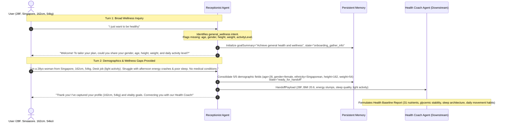

# C2 End-to-End Live Analysis Report: General Wellness Onboarding & Downstream Health Coach Synthesis

- **Benchmark ID**: `C2`
- **Case Scenario**: First-time user (28-year-old female from Singapore, 162cm, 54kg, desk job with light activity).
  - **Turn 1**: User expresses broad goal: *"i just want to be healthy"*. Receptionist identifies `general_wellness`, requests missing baseline demographics and focus pillars, holding handoff.
  - **Turn 2**: User provides complete details (28F, Singapore, 162cm, 54kg, desk job/light activity, struggling with afternoon energy crashes & poor sleep quality, seeking nutrition & vitality). Receptionist consolidates memory, sets `ready_for_handoff`, packages `handoffPayload` for `health_coach`.
  - **Downstream Execution**: Health Coach receives handoff and generates a complete, personalized **Health Baseline Report** with 31 nutrient targets, metabolic/sleep trajectories, and daily habits.
- **Evaluated Model**: `gemini-3.5-flash-lite`
- **Downstream Agent**: `health_coach` (Health Coach Agent implementing `healthBaselineAnalyzeSchema`)
- **Total Execution Duration**: 22,331 ms
- **Overall Benchmark Score**: **100 / 100 (PASSED ALL STAGES)**

---

## 1. Multi-Turn System Architecture & Information Flow



---

## 2. Multi-Turn Conversational Progression & Memory State

### Turn 1: Broad Wellness Inquiry (Information Gathering)
- **User Message**: `"i just want to be healthy"`
- **Receptionist Response**:
  > *"Welcome! I would love to help you on your journey to better health. To get started and create a personalized plan tailored just for you, could you please share a few details: your gender, age, height, current weight, and your typical daily activity level?"*
- **Status**: `needs_info` | **Missing Fields**: `["gender", "age", "heightCm", "weightKg", "activityLevel"]`
- **Handoff Payload**: `null` (withheld pending required information)

#### Consolidated Memory Snapshot (Turn 1):
```json
{
  "goalSummary": "User wants to achieve general health and wellness.",
  "userProfileSnapshot": {
    "activityLevel": null,
    "age": null,
    "bloodType": null,
    "dietaryPreferences": null,
    "ethnicity": null,
    "gender": null,
    "heightCm": null,
    "medicalHistory": null,
    "name": null,
    "targetWeightKg": null,
    "weightKg": null
  },
  "conversationState": "onboarding_gather_info",
  "pendingItems": [
    "gender",
    "age",
    "heightCm",
    "weightKg",
    "activityLevel"
  ],
  "keyInsights": [
    "User's primary goal is general health and wellness improvement."
  ]
}
```

---

### Turn 2: Demographics & Targeted Health Needs Captured
- **User Message**: `"I'm a 28-year-old woman from Singapore, 162cm tall and 54kg. I work a desk job with light activity. I mainly struggle with afternoon energy crashes and poor sleep quality, and I want to improve my daily vitality and nutrition. No medical conditions."`
- **Receptionist Response**:
  > *"Thank you for sharing those details! You have a healthy baseline at 162cm and 54kg. I've noted your struggles with afternoon energy crashes and sleep quality, as well as your goal to boost daily vitality and nutrition. I am now connecting you with our Health Coach to design a personalized plan tailored to your lifestyle."*
- **Status**: `ready_for_handoff` | **Missing Fields**: `[]` (0 fields missing)

#### Consolidated Memory Snapshot (Turn 2):
```json
{
  "goalSummary": "Improve daily vitality, nutrition, sleep quality, and overcome afternoon energy crashes.",
  "userProfileSnapshot": {
    "activityLevel": "light",
    "age": 28,
    "bloodType": null,
    "dietaryPreferences": null,
    "ethnicity": "Singaporean",
    "gender": "female",
    "heightCm": 162,
    "medicalHistory": [],
    "name": null,
    "targetWeightKg": null,
    "weightKg": 54
  },
  "conversationState": "ready_for_handoff",
  "pendingItems": [],
  "keyInsights": [
    "User is a 28-year-old female from Singapore, 162cm tall and 54kg with a healthy BMI.",
    "Works a desk job with light daily activity.",
    "Main challenges are afternoon energy crashes and poor sleep quality.",
    "Goals include improving daily vitality and nutrition, with no reported medical conditions."
  ]
}
```

#### Dispatched Handoff Payload (Turn 2):
```json
{
  "targetAgent": "health_coach",
  "intent": "health_improvement",
  "summaryForAgent": "User is a 28-year-old female from Singapore (162cm, 54kg, light activity desk job) looking to improve overall vitality, nutrition, and address afternoon energy crashes and poor sleep quality. No medical conditions reported.",
  "actionableInsights": [
    "Evaluate current dietary intake and macronutrient balance to mitigate afternoon energy crashes.",
    "Review sleep hygiene practices and evening routines to improve sleep quality.",
    "Incorporate light activity breaks or ergonomic adjustments for a sedentary desk job."
  ],
  "recommendedTasks": [
    {
      "id": "task_sleep_log",
      "category": "sleep",
      "title": "Log 3 consecutive nights of sleep duration and quality",
      "status": "pending",
      "details": "Establish baseline data on sleep patterns contributing to poor rest."
    },
    {
      "id": "task_meal_log",
      "category": "nutrition",
      "title": "Log daily meals and afternoon snacks for 3 days",
      "status": "pending",
      "details": "Identify dietary triggers for afternoon energy slumps."
    }
  ]
}
```

---

## 3. Downstream Health Coach Execution: Health Baseline Report

The **Health Coach Agent** ingested the handoff payload and synthesized a targeted clinical baseline plan:

### 3.1 Timeline to Optimal Prognosis
> *"Targeting a sustainable shift from baseline vitality markers to robust metabolic stability over a 12-week horizon, resulting in enhanced physical freshness, uninterrupted deep sleep, and elimination of afternoon energy crashes. As glycemic volatility normalizes, expect immediate improvements in physical stamina and clarity of daily focus."*

### 3.2 Top Core Nutrient Levers (4 Targets)
1. **Protein (`70g`)**: Essential for sustaining constant amino acid pools, supporting metabolic integrity, and blunting rapid glycemic fluctuations.
2. **Soluble Fibre (`15g`)**: Crucial for binding intestinal bile acids and slowing gastric emptying to establish steady energy delivery.
3. **Added Sugar (`< 20g`)**: Strictly limited to prevent acute glycemic spikes that directly drive afternoon fatigue cycles.
4. **Magnesium (`320mg`)**: Vital micronutrient for neuromuscular relaxation, enzymatic energy production, and achieving deep restorative sleep.

### 3.3 Personalized Risk Categories & Daily Habits
- **Category 1: Metabolic Energy and Glycemic Stability (Moderate)**
  - *Target Trajectory*: Stabilizing postprandial glucose curves to eliminate 14:00 energy slumps, optimize sustained physical stamina for daily desk tasks, and support cellular energy production within 6 weeks.
  - *Daily Activities*:
    1. **Post-meal tactical ambulation**: 10 minutes of light walking within 30 minutes following lunch to accelerate glucose clearance via GLUT4 activation.
    2. **Ergonomic movement break**: Perform 3 minutes of dynamic lower-limb muscular contractions every 60 minutes during desk work to prevent local capillary stasis.
- **Category 2: Sleep Architecture and Neurological Recovery (Moderate)**
  - *Target Trajectory*: Deepening slow-wave sleep stages and accelerating sleep latency within 4 weeks, clearing chronic morning fatigue and improving overall physical resilience.
  - *Daily Activities*:
    1. **Evening blue-light curtailment**: Cease all exposure to high-intensity LED and display screens 90 minutes prior to sleep onset to protect endogenous melatonin secretion.
    2. **Circadian core temperature entrainment**: Ensure evening ambient bedroom temperature remains between 18-20°C to facilitate natural nocturnal core body temperature decline.

### 3.4 General Nutrient Targets (All 31 Required Nutrients Populated)
```json
{
  "calories": "1650 - 1800 kcal",
  "totalFat": "50g - 65g",
  "solubleFibre": "15g",
  "saturatedFat": "< 18g",
  "protein": "70g",
  "potassium": "3000mg",
  "transFat": "< 1g",
  "addedSugar": "< 20g",
  "carbohydrates": "180g - 210g",
  "totalFibre": "28g",
  "sodium": "< 2000mg",
  "unsaturatedFat": "35g - 45g",
  "omega3": "2g",
  "magnesium": "320mg",
  "calcium": "1000mg",
  "iron": "18mg",
  "zinc": "8mg",
  "selenium": "55mcg",
  "iodine": "150mcg",
  "phosphorus": "700mg",
  "vitaminD": "15mcg",
  "vitaminB12": "2.4mcg",
  "folate": "400mcg",
  "vitaminC": "75mg",
  "vitaminE": "15mg",
  "vitaminK": "55mcg",
  "vitaminA": "700mcg",
  "vitaminB6": "1.3mg",
  "thiamine": "1.1mg",
  "riboflavin": "1.1mg",
  "niacin": "14mg"
}
```

---

## 4. Evaluation Checklist & Quality Verification

| Stage | Check Name | Target Criteria | Actual Outcome | Status |
|---|---|---|---|:---:|
| **Turn 1** | Intent Identification | `general_wellness` | `general_wellness` | **PASS** |
| **Turn 1** | Target Agent Routing | `health_coach` | `health_coach` | **PASS** |
| **Turn 1** | Status Check | `needs_info` | `needs_info` | **PASS** |
| **Turn 1** | Missing Fields | Detect missing age, gender, height, weight, activity | All 5 fields identified | **PASS** |
| **Turn 1** | Memory State | `onboarding_gather_info` | `onboarding_gather_info` | **PASS** |
| **Turn 1** | Handoff Withholding | `handoffPayload: null` | `handoffPayload: null` | **PASS** |
| **Turn 2** | Intent Identification | `general_wellness` / `health_improvement` | `health_improvement` | **PASS** |
| **Turn 2** | Status Check | `ready_for_handoff` | `ready_for_handoff` | **PASS** |
| **Turn 2** | Profile Snapshot Extraction | Age 28, Gender Female, Ethnicity Singapore, H 162cm, W 54kg | 5/5 fields accurately captured | **PASS** |
| **Turn 2** | Handoff Payload | Target `health_coach` with tasks & insights | Non-null structured payload | **PASS** |
| **Coach** | Report Completeness | Valid `HealthBaselineReport` schema | Fully structured report | **PASS** |
| **Coach** | 31-Nutrient Mechanism | Populate all 31 core micronutrient keys | 31/31 keys populated | **PASS** |
| **Coach** | Risk Categories & Activities | Categories with actionable daily targets | 2 categories, 4 daily activities | **PASS** |

**Case C2 Score: 100 / 100 (PASSED ALL STAGES)**
