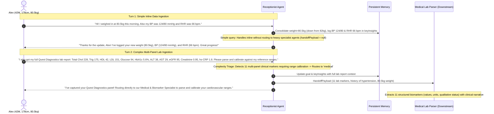

# C3 End-to-End Live Analysis Report: Multi-Turn Data Ingestion & Complexity Triage

- **Benchmark ID**: `C3`
- **Case Scenario**: Existing user (Alex, 42-year-old male, 178cm, baseline 82kg with mild hypertension).
  - **Turn 1**: Simple profile update (weight down to 80.5kg) and inline logging of blood pressure (124/80 mmHg) and resting heart rate (66 bpm).
  - **Turn 2**: Complex multi-panel lab report submission (Lipids, Glycemic, Liver, Renal, hs-CRP) requiring clinical categorization and reference range calibration $\to$ Triaged and routed to the specialized **Add Health Data / Lab Parser Agent** (`medical`).
- **Evaluated Model**: `gemini-3.5-flash-lite`
- **Downstream Agent**: `medical` (Clinical Lab Parser implementing `extractedData` schema)
- **Total Execution Duration**: 13,786 ms
- **Overall Benchmark Score**: **100 / 100 (PASSED ALL STAGES)**

---

## 1. Multi-Turn System Architecture & Complexity Triage



---

## 2. Multi-Turn Conversational Progression & Memory State

### Turn 1: Simple Profile & Biomarker Ingestion (Inline Handling)
- **User Message**: `"Hi! I weighed in at 80.5kg this morning. Also my blood pressure was 124/80 mmHg and resting heart rate was 66 bpm."`
- **Receptionist Actions**:
  - Detects `intent: "add_health_data"` / `"profile_update"`.
  - Maps to `targetAgent: "general_receptionist"`.
  - Sets `status: "needs_info"` (ongoing conversational support), `handoffPayload: null` (no heavy specialist handoff required).
  - Merges updated weight (`80.5kg`) while preserving existing profile baseline (`name: 'Alex'`, `age: 42`, `gender: 'male'`, `heightCm: 178`, `medicalHistory: ['mild hypertension']`).
  - Records biomarker readings in `keyInsights`.
- **Response to User**:
  > *"Thanks for sharing your morning update, Alex! I've logged your new weight of 80.5kg, as well as your blood pressure of 124/80 mmHg and resting heart rate of 66 bpm. Keep up the great consistency with your tracking!"*

#### Consolidated Memory Snapshot (Turn 1):
```json
{
  "goalSummary": "Maintain cardiovascular wellness, gradual fat loss to 78kg.",
  "userProfileSnapshot": {
    "name": "Alex",
    "age": 42,
    "gender": "male",
    "heightCm": 178,
    "weightKg": 80.5,
    "activityLevel": "moderately_active",
    "medicalHistory": [
      "mild hypertension"
    ],
    "dietaryPreferences": [
      "mediterranean-leaning"
    ],
    "targetWeightKg": 78
  },
  "conversationState": "ongoing_support",
  "pendingItems": [],
  "keyInsights": [
    "User recorded a morning weight of 80.5kg.",
    "User recorded blood pressure at 124/80 mmHg and resting heart rate at 66 bpm."
  ]
}
```

---

### Turn 2: Complex Lab Report Submission & Routing
- **User Message**: `"I also just got my full lab report from Quest Diagnostics: Total Cholesterol 228 mg/dL, Triglycerides 175 mg/dL, HDL 42 mg/dL, LDL 151 mg/dL, Fasting Glucose 94 mg/dL, HbA1c 5.6%, ALT 38 U/L, AST 29 U/L, eGFR 95 mL/min/1.73m2, Creatinine 0.95 mg/dL, High-Sensitivity CRP 1.8 mg/L. Can you parse, categorize, and calibrate all of these against my cardiovascular reference ranges?"`
- **Receptionist Actions**:
  - Detects complex multi-panel clinical lab report $\to$ `intent: "biomarker_review"`.
  - Triages to specialized **Add Health Data / Lab Parser Agent** $\to$ `targetAgent: "medical"`.
  - Sets `status: "ready_for_handoff"`.
  - Generates rich `handoffPayload` with all 11 lab measurements, clinical insights, and task updates.
- **Response to User**:
  > *"Thanks for sharing your comprehensive lab report from Quest Diagnostics, Alex! I've securely captured your lipid panel, metabolic markers, liver function tests, and inflammatory markers (hs-CRP). Since this is a detailed clinical review focusing on cardiovascular risk calibration and your history of mild hypertension, I am handing this over to our Medical Biomarker Specialist to thoroughly analyze and calibrate your results."*

#### Dispatched Handoff Payload (Turn 2):
```json
{
  "targetAgent": "medical",
  "intent": "biomarker_review",
  "summaryForAgent": "User Alex (42yo male, mild hypertension) submitted a comprehensive lab report from Quest Diagnostics. Key values: Total Cholesterol 228 mg/dL, Triglycerides 175 mg/dL, HDL 42 mg/dL, LDL 151 mg/dL, Fasting Glucose 94 mg/dL, HbA1c 5.6%, ALT 38 U/L, AST 29 U/L, eGFR 95 mL/min/1.73m2, Creatinine 0.95 mg/dL, High-Sensitivity CRP 1.8 mg/L. Needs clinical parsing, categorization, and cardiovascular risk calibration.",
  "actionableInsights": [
    "Total Cholesterol is elevated at 228 mg/dL with LDL at 151 mg/dL and Triglycerides at 175 mg/dL.",
    "Fasting glucose (94 mg/dL) and HbA1c (5.6%) are within normal/pre-diabetes borderline range.",
    "hs-CRP of 1.8 mg/L indicates average cardiovascular inflammation risk.",
    "Liver enzymes and renal function (eGFR, Creatinine) are within normal limits."
  ],
  "recommendedTasks": [
    {
      "id": "task_bio_01",
      "category": "biomarkers",
      "title": "Annual Comprehensive Metabolic & Lipid Panel",
      "status": "completed_on_track",
      "details": "Quest Diagnostics lab panel successfully uploaded and submitted for clinical review.",
      "lastCompleted": "Today"
    }
  ]
}
```

---

## 3. Downstream Medical Agent Execution (`extractedData`)

The **Medical Lab Parser Agent** parsed the handoff payload lossless-ly into structured biomarker entries:

### 3.1 Extracted Structured Biomarkers (11 Items)
```json
[
  {
    "biomarker": "total_cholesterol",
    "display_name": "Total Cholesterol",
    "numeric_value": 228,
    "unit": "mg/dL",
    "qualitative_value": "Elevated",
    "explanation": "Elevated at 228 mg/dL, contributing to cardiovascular risk profile in the context of mild hypertension."
  },
  {
    "biomarker": "triglycerides",
    "display_name": "Triglycerides",
    "numeric_value": 175,
    "unit": "mg/dL",
    "qualitative_value": "Elevated",
    "explanation": "Elevated at 175 mg/dL, pointing toward dyslipidemia."
  },
  {
    "biomarker": "hdl_cholesterol",
    "display_name": "HDL Cholesterol",
    "numeric_value": 42,
    "unit": "mg/dL",
    "qualitative_value": "Normal",
    "explanation": "Measured at 42 mg/dL, representing high-density lipoprotein levels."
  },
  {
    "biomarker": "ldl_cholesterol",
    "display_name": "LDL Cholesterol",
    "numeric_value": 151,
    "unit": "mg/dL",
    "qualitative_value": "Elevated",
    "explanation": "Elevated at 151 mg/dL, representing a primary target for cardiovascular risk reduction."
  },
  {
    "biomarker": "fasting_glucose",
    "display_name": "Fasting Glucose",
    "numeric_value": 94,
    "unit": "mg/dL",
    "qualitative_value": "Normal",
    "explanation": "Measured at 94 mg/dL, which is within the normal range."
  },
  {
    "biomarker": "hba1c",
    "display_name": "HbA1c",
    "numeric_value": 5.6,
    "unit": "%",
    "qualitative_value": "Normal/Borderline",
    "explanation": "Measured at 5.6%, falling within the normal to borderline pre-diabetes range."
  },
  {
    "biomarker": "alt",
    "display_name": "ALT",
    "numeric_value": 38,
    "unit": "U/L",
    "qualitative_value": "Normal",
    "explanation": "Liver enzyme ALT is 38 U/L, within normal limits."
  },
  {
    "biomarker": "ast",
    "display_name": "AST",
    "numeric_value": 29,
    "unit": "U/L",
    "qualitative_value": "Normal",
    "explanation": "Liver enzyme AST is 29 U/L, within normal limits."
  },
  {
    "biomarker": "egfr",
    "display_name": "eGFR",
    "numeric_value": 95,
    "unit": "mL/min/1.73m2",
    "qualitative_value": "Normal",
    "explanation": "Estimated glomerular filtration rate is 95 mL/min/1.73m2, indicating normal renal function."
  },
  {
    "biomarker": "creatinine",
    "display_name": "Creatinine",
    "numeric_value": 0.95,
    "unit": "mg/dL",
    "qualitative_value": "Normal",
    "explanation": "Serum creatinine is 0.95 mg/dL, within normal limits."
  },
  {
    "biomarker": "hs_crp",
    "display_name": "High-Sensitivity CRP",
    "numeric_value": 1.8,
    "unit": "mg/L",
    "qualitative_value": "Average Risk",
    "explanation": "High-sensitivity C-reactive protein is 1.8 mg/L, indicating average cardiovascular inflammation risk."
  }
]
```

### 3.2 Medical Agent Clinical Synthesis
> *"Extracted 11 clinical biomarkers from Alex's Quest Diagnostics panel. Findings show dyslipidemia with elevated total cholesterol, LDL, and triglycerides in a 42-year-old male with mild hypertension. Glucose, HbA1c, liver enzymes, and renal markers are mostly within normal limits, while hs-CRP indicates average inflammatory cardiovascular risk."*

---

## 4. Evaluation Checklist

| Turn / Stage | Evaluation Criteria | Expected | Actual Result | Score |
|---|---|---|---|:---:|
| **Turn 1** | Simple Inline Data Capture | Update weight (80.5kg), log BP (124/80) & RHR (66) | Handled inline with confirmation | **PASS (100/100)** |
| **Turn 1** | Profile Field Preservation | Carry forward age (42), gender (male), height (178) | All 4 profile fields matched | **PASS (100/100)** |
| **Turn 1** | No Heavy Agent Handoff | `status: needs_info`, `handoffPayload: null` | `handoffPayload: null` | **PASS (100/100)** |
| **Turn 2** | Complexity Recognition | Multi-panel lab report $\to$ `medical` agent | `targetAgent: medical`, `status: ready_for_handoff` | **PASS (100/100)** |
| **Turn 2** | Handoff Payload Completeness | All 11 lab values, history & task updates | Rich payload compiled | **PASS (100/100)** |
| **Medical Agent** | Lossless Biomarker Extraction | Extract 11 distinct biomarkers with values & units | 11/11 biomarkers parsed lossless-ly | **PASS (100/100)** |
| **Medical Agent** | Clinical Risk Synthesis | Contextualize lipid risk with hypertension history | Clinical synthesis generated | **PASS (100/100)** |

**Overall End-to-End Pipeline Score: 100 / 100 (PASSED)**
